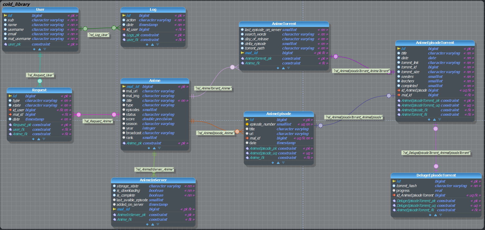

# Cold Library Backend


## Endpoints

| Type | Path | Description | Lien          |
|------|------|-------------|---------------|
| GET  |      |             | [Readme.md]() |

## Base de données



## Pour tester

TODO : Section à compléter

## Dépendances installé

### Base MSSQL

Une base de données iso de nos environnements actuel

### Flyway

Flyway est un outil de migrations de base de données. Il permet de gérer le contrôle de versions de votre base de
données.

### Mockito avec MockK et SpringMockK

Mockito pour effectuer des tests bouchonnés

### Rest assured et son support Kotlin

Un framework pour améliorer la mise en place de test d'intégration

## Lancé l'application en HotReload

La dépendance spring-boot-devtools permmet la mise en place de hot reload spring

La fonctionnalité fait redémarrer le server spring à la modification

### Configuration IntelliJ

Dans les settings IntelliJ > Advance Settings > Compiler :
coché l'option intitulé : "Allow auto-mak to start even if developped application is currently running"

### Utilisation

Démarrer une nouvelle configuration graddle avec dans run 

```compileKotlin -t```

Démarrer en parallèle votre application avec bootrun et le profile qui vous interesse

## Build a image

Utiliser le Dockerfile pour construire une image de votre backend

## Base de données

L'outil utilise une base de données Postgresql.

L'outil Liquibase gère automatiquement les migrations de structure de base de données.